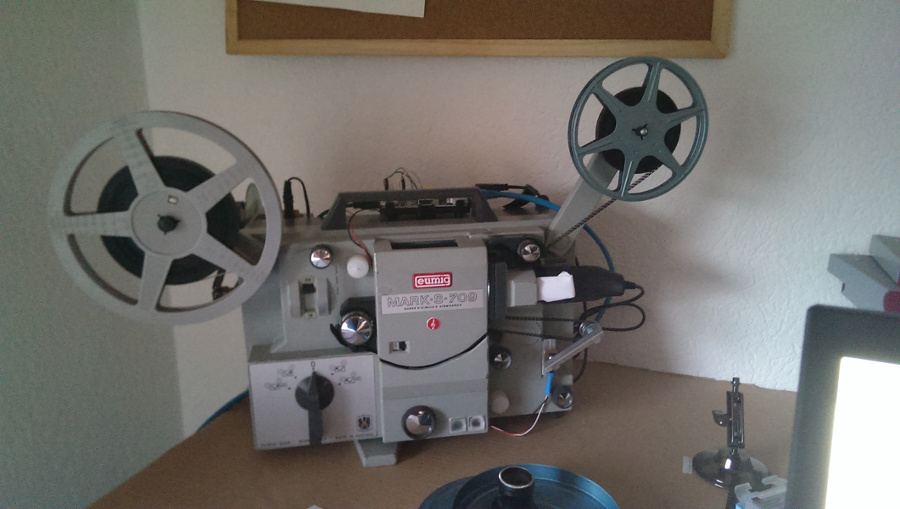
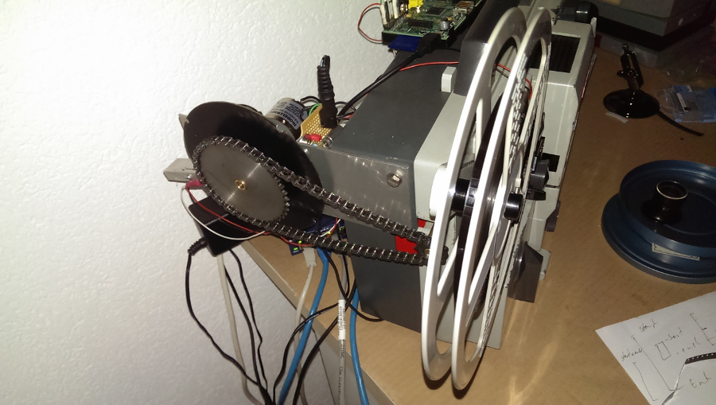
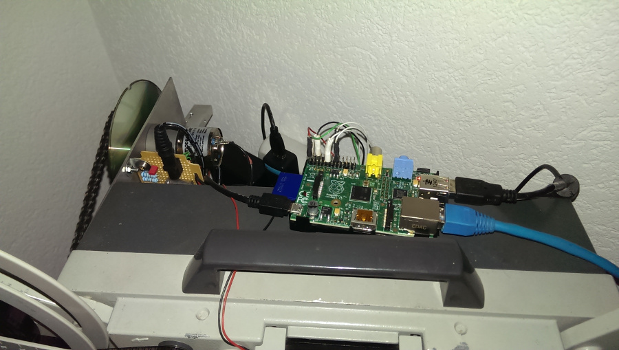

superPi8
========

Make with RaspberryPI a 8mm Movie Scanner 


The Project
===========





Installation
============
Distribution:
- Raspbian 3.12
- http://www.raspberrypi.org/downloads/#

Install git:
------------
``` bash
apt-get install git
```
Install gcc:
------------
``` bash
apt-get install gcc
apt-get install make
```
Install wiringpi:
-----------------
``` bash
git clone git://git.drogon.net/wiringPi
cd wiringPi
git pull origin
cd wiringPi
./build
for more information: http://wiringpi.com/download-and-install/
```
Install libraries:
------------------
``` bash
apt-get install libnewt-dev
apt-get install libncurses-dev
apt-get install libv4l-dev
```
Install superPi8:
-----------------
``` bash
git clone https://github.com/codeix/superPi8.git
cd superPi8
make
```
